<div align="center">

# ros2_robot_course

**ROS2 Humble + Gazebo 11 差速移动机器人全流程仿真工程**

自建宫殿场景 · 180° 雷达 + 紫色科幻摄像头 · slam_toolbox 建图 · AMCL 定位 · Nav2 多目标自主导航

<p>
  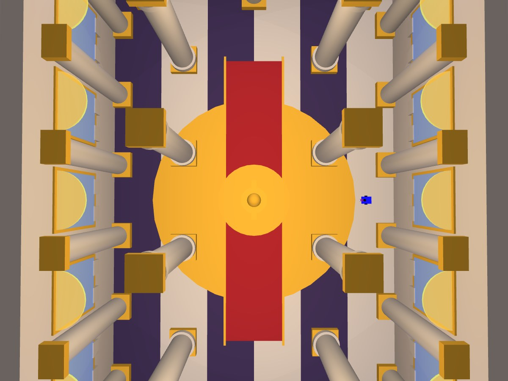
  &nbsp;&nbsp;
  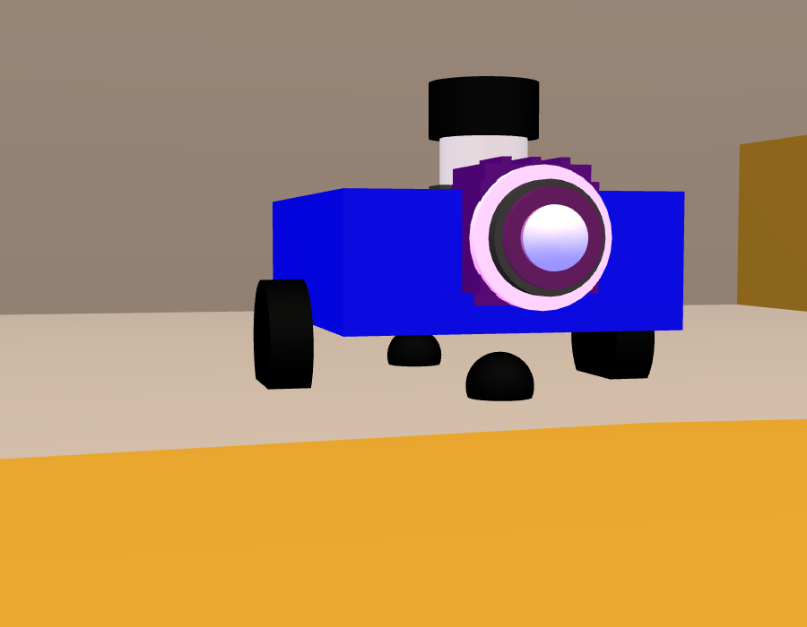
</p>

<sub>左：自建宫殿大厅俯视（环形柱廊 / 中央喷泉 / 彩窗）　右：机器人特写（紫色科幻摄像头 + 180° 广角）</sub>

</div>

---

## 一、环境说明

| 项目 | 版本 / 说明 |
| --- | --- |
| 操作系统 | Ubuntu 22.04 LTS 64-bit |
| ROS | ROS2 Humble |
| 仿真器 | Gazebo 11.10.2（gazebo_ros_pkgs） |
| 建图 | slam_toolbox 2.6.x（在线异步） |
| 导航 | Navigation2（nav2_bringup 1.1.x） |
| 遥控 | teleop_twist_keyboard |
| 可视化 | RViz2 |

依赖包（换机复现时安装；本机已预装，无需执行）：

```bash
sudo apt install ros-humble-gazebo-ros-pkgs ros-humble-xacro \
     ros-humble-robot-state-publisher ros-humble-joint-state-publisher \
     ros-humble-slam-toolbox ros-humble-navigation2 ros-humble-nav2-bringup \
     ros-humble-teleop-twist-keyboard ros-humble-rviz2
```

> **仓库结构**：本仓库就是一个 ROS2 工作空间，功能包源码位于 `src/ros2_robot_course/`。
> **xacro 可选**：`robot_gazebo.launch.py` 优先用 xacro 解析 `.xacro`，环境没装时自动回退到展开好的 `.urdf`。
> **多机隔离**：若同一网段有他人也在跑 ROS2，先 `export ROS_DOMAIN_ID=77 && export ROS_LOCALHOST_ONLY=1` 再启动。

---

## 二、工程目录结构

```
ros2_robot_course/                          # 工作空间根
├── README.md
├── docs/images/                            # 效果图 / 运行证据
└── src/
    └── ros2_robot_course/                  # 功能包
        ├── package.xml / setup.py / setup.cfg
        ├── resource/ros2_robot_course
        └── ros2_robot_course/
            ├── send_goal.py                # 命令行一键发导航目标点（免 RViz 鼠标）
            ├── verify_nav.py               # 自动多目标验收 + 在线采样出量化报告
            ├── moving_obstacle.py          # 生成会巡逻的动态障碍物（演示动态避障）
            ├── world/
            │   ├── room.world              # 宫殿大厅场景
            │   ├── moving_obstacle.sdf     # 动态障碍物模型
            │   └── generate_palace.py      # 场景生成脚本
            ├── urdf/
            │   ├── robot.urdf.xacro        # 差速两轮 + 雷达 + 摄像头（源文件）
            │   └── robot.urdf              # 展开后的等价 URDF（回退用）
            ├── launch/
            │   ├── robot_gazebo.launch.py      # 任务1：场景 + 机器人 + TF
            │   ├── slam.launch.py              # 任务2：SLAM 建图 + RViz
            │   └── nav2_localization.launch.py # 任务3/4：地图 + AMCL + Nav2 + RViz
            ├── config/
            │   ├── slam_toolbox.yaml       # 建图参数
            │   ├── nav2_params.yaml        # Nav2 全套参数（AMCL/代价地图/规划/控制）
            │   └── robot.rviz / slam.rviz / nav2.rviz
            └── maps/
                ├── map.pgm / map.yaml      # 现场 SLAM 生成的地图
                └── generate_reference_map.py
```

---

## 三、编译

```bash
cd "/home/xieyihan/Documents/Default Project"   # 换成你的工作空间根目录
colcon build --symlink-install
source install/setup.bash
```

> 每个新开的终端都要先 `source install/setup.bash`。修改 `config/*.yaml` 或重新保存地图后，重新执行一次 `colcon build --symlink-install --packages-select ros2_robot_course`。

---

## 四、演示操作顺序（按顺序复制执行）

### 步骤 1　仿真启动（任务 1）

```bash
ros2 launch ros2_robot_course robot_gazebo.launch.py rviz:=true
```

应看到 Gazebo 宫殿场景 + 小车，RViz 中有模型、激光点、TF。另开终端遥控验证：

```bash
ros2 run teleop_twist_keyboard teleop_twist_keyboard   # i 前进  , 后退  j 左转  l 右转  k 停
```

### 步骤 2　SLAM 建图（任务 2）

```bash
ros2 launch ros2_robot_course slam.launch.py
```

另开终端遥控小车绕大厅一圈，RViz 中二维栅格地图逐渐成形。

### 步骤 3　保存地图（任务 2）

```bash
ros2 run nav2_map_server map_saver_cli \
  -f "/home/xieyihan/Documents/Default Project/src/ros2_robot_course/ros2_robot_course/maps/map"
# 使新地图安装到 install/ 供下一步加载
cd "/home/xieyihan/Documents/Default Project" && colcon build --symlink-install --packages-select ros2_robot_course
```

出现 `Map saved successfully`，`maps/` 下生成 `map.pgm`（图像）+ `map.yaml`（元数据）。

### 步骤 4　关闭全部进程并重启（考核硬性要求）

```bash
# 在运行中的终端按 Ctrl+C，然后清理残留
killall -9 gzserver gzclient; sleep 2
```

### 步骤 5　加载地图 + AMCL 定位 + Nav2 导航（任务 3 / 任务 4）

```bash
ros2 launch ros2_robot_course nav2_localization.launch.py
```

在该终端日志中出现以下行即代表导航栈全部就绪：

```
[lifecycle_manager]: Managed nodes are active
```

> 用 `2D Pose Estimate` 给出/纠正初始位姿；绿色粒子云收拢、激光点与地图墙体重合即定位成功。

### 步骤 6　发送导航目标点（任务 4，二选一）

- **RViz 方式**：点工具栏 `Nav2 Goal`，在地图上依次点击多个目标点。
- **命令行方式（免鼠标）**：

```bash
ros2 run ros2_robot_course send_goal 3.0 0.0        # 去 (3.0, 0.0)
ros2 run ros2_robot_course send_goal -3.0 0.0 3.14  # 去 (-3.0, 0.0)，直线穿过中央喷泉会自动绕行
ros2 run ros2_robot_course send_goal 0.0 4.5
```

到达会打印 `✅ 已到达目标点！`，小车自动停车。

### 步骤 7　自动量化验收（亮点）

```bash
ros2 run ros2_robot_course verify_nav
```

自动发送多个目标点并在线采样 `/scan`、`/cmd_vel`、`/amcl_pose`，在 `verify_logs/verify_<时间戳>/summary.md` 输出量化报告（到达率、贴障次数、到点位置/朝向误差、最小激光余量、话题实测频率）。

### 步骤 8　动态障碍避障（亮点）

```bash
# 导航栈运行中，另开终端启动会巡逻的障碍物
ros2 run ros2_robot_course moving_obstacle
# 让机器人沿走廊走，观察实时避让
ros2 run ros2_robot_course verify_nav --goals "4.0,-4.4,0.0;-4.0,-4.4,3.14;0.0,-4.8,1.57"
# 演示完关闭障碍物
pkill -9 -x moving_obstacle
```

---

## 五、关键参数调优说明

- **AMCL**：`max/min_particles = 2000/500`，`laser_model_type = likelihood_field`，预置出生位姿 (`0, -4.8, 90°`) 保证 Nav2 生命周期可自动激活。
- **代价地图**：机器人按包围圆半径 `robot_radius = 0.25 m`，膨胀半径 `inflation_radius = 0.45 m`，`cost_scaling_factor = 3.0`，防止贴墙、撞墙。
- **全局规划器**：`NavfnPlanner`，`tolerance = 0.15`，`allow_unknown = true`。
- **局部控制器**：`DWBLocalPlanner`，`max_vel_x = 0.30 m/s`、`max_vel_theta = 1.0 rad/s`，critics 含 `BaseObstacle / PathDist / GoalDist / RotateToGoal`。
- **到点判定**：`xy_goal_tolerance = 0.10 m`、`yaw_goal_tolerance = 0.12 rad`（验收 0.25 m / 15° 以内，留足余量）。
- **速度平滑**：`/cmd_vel` 经 `velocity_smoother` 限幅到 `0.30 m/s / 1.0 rad/s`，避免急停急转。
- **前置摄像头**：`horizontal_fov = 3.1415 rad`（≈180° 超广角）、640×480 @30Hz、`frame_name = camera_optical_frame`；紫色外壳/发光灯带/半透明镜片分别用 `Gazebo/Indigo / PurpleGlow / DarkMagentaTransparent + BlueGlow` 材质实现。

---

## 六、本工程编写内容 / 第三方包来源

**第三方（ROS2 官方，未修改）**：slam_toolbox、Navigation2（amcl / controller / planner / behaviors / bt_navigator / waypoint_follower / velocity_smoother / lifecycle_manager / costmap_2d）、gazebo_ros_pkgs（diff_drive / ray_sensor / camera / joint_state_publisher 插件）、robot_state_publisher、teleop_twist_keyboard、rviz2。

**本工程自主编写**：
- 宫殿大厅场景 `world/room.world`（18m×12m、环形柱廊、浮雕壁柱、金色檐口、中央喷泉雕像、拱形彩窗、多盏暖色点光源，顶部开放）及生成脚本；
- 机器人模型 `urdf/robot.urdf.xacro`（差速两轮 + 前后万向轮 + 2D 激光雷达 + 前置紫色科幻摄像头）；
- 全部 launch 文件（Python 格式）、全部 YAML 参数、三套 RViz 配置、`send_goal.py` 命令行工具；
- 自动量化验收脚本 `verify_nav.py`：自动发多目标、在线采样三个话题，输出到达率/贴障/误差/余量/频率；
- 动态障碍物 `moving_obstacle.py` + `world/moving_obstacle.sdf`：导航阶段生成会巡逻的障碍物，演示 Nav2 动态避障/重规划（不影响 SLAM 地图）。

---

## 七、运行效果 / 运行证据

| 建图（slam_toolbox + RViz） | 保存地图 | 生成的地图 |
| :---: | :---: | :---: |
| 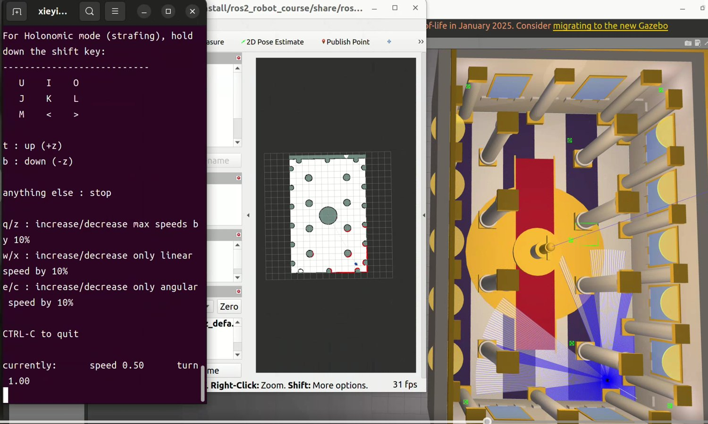 | 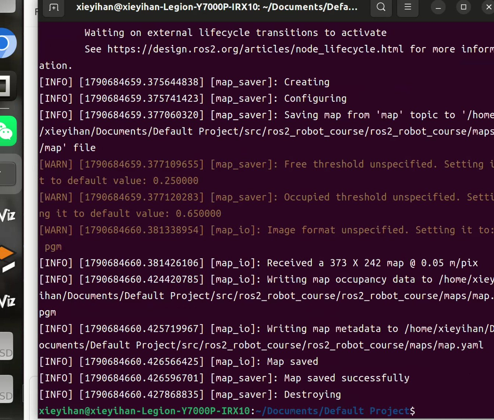 | 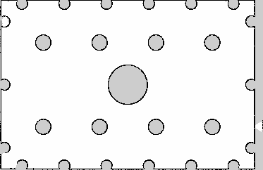 |

| 导航栈就绪 | 路径规划与到点 | 机器人 / 摄像头 |
| :---: | :---: | :---: |
| 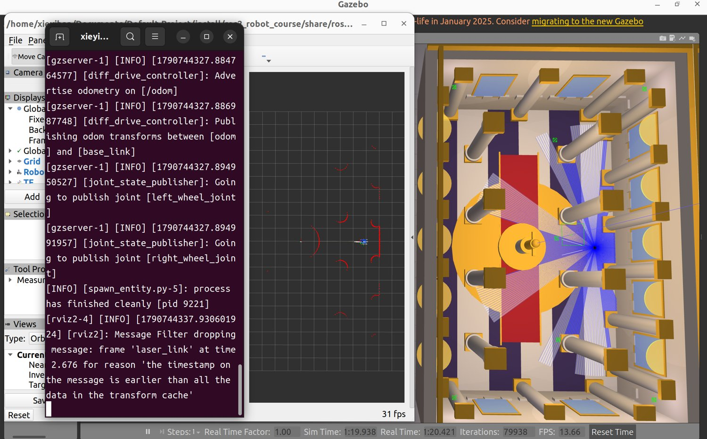 | 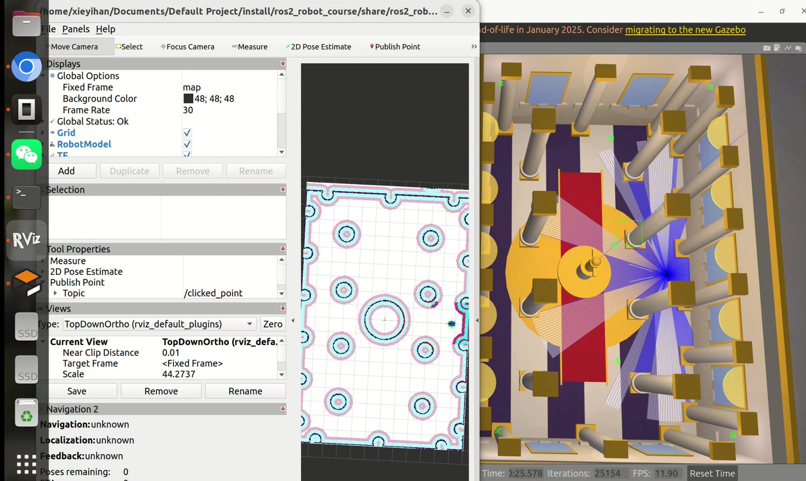 | 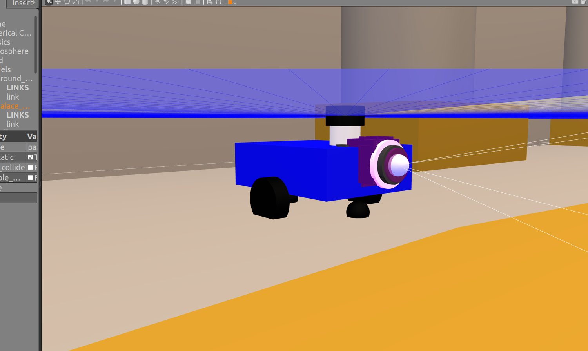 |

### 自动量化验收（verify_nav）

| 自动量化验收报告 | 动态障碍物巡逻 | 动态避障验收 |
| :---: | :---: | :---: |
| 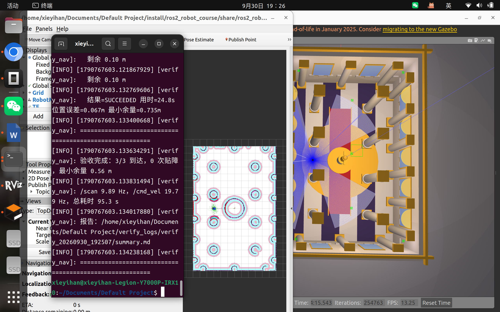 | 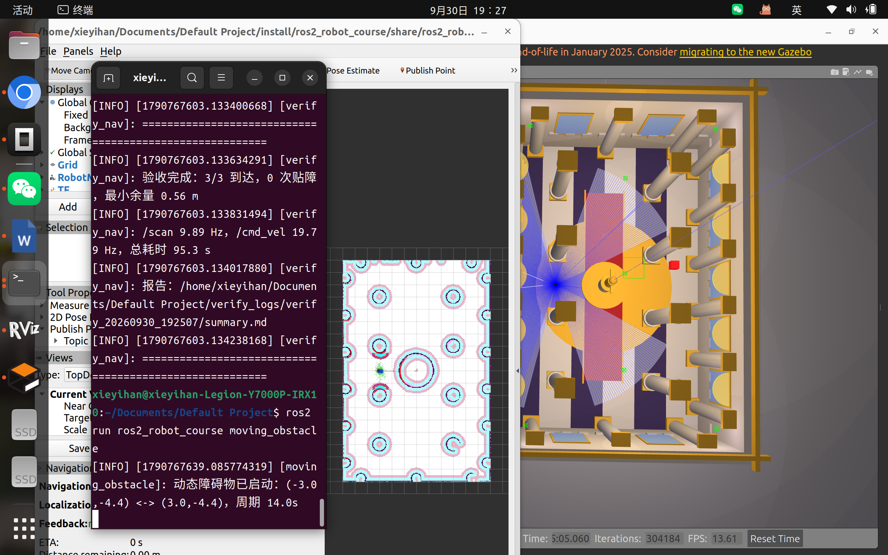 | 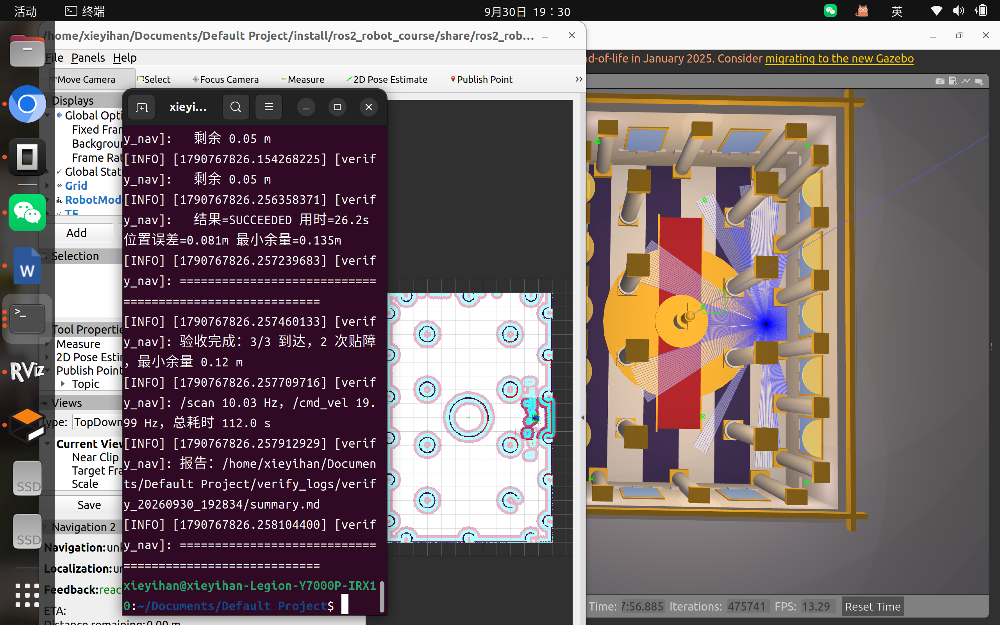 |

> 左：`ros2 run ros2_robot_course verify_nav` 自动发多目标并在线采样 `/scan`、`/cmd_vel`、`/amcl_pose`，输出到达率、贴障次数、到点误差、最小激光余量与话题频率（报告见 `verify_logs/`）；
> 中：`moving_obstacle` 在导航阶段生成会来回巡逻的红色障碍物（不参与建图）；
> 右：带动态障碍时仍 **3/3 到达**，与移动方块最近擦到 **0.12 m** 未发生碰撞。

---

## 八、常见故障与解决办法

| 现象 | 原因 | 解决 |
| --- | --- | --- |
| RViz 报 `No transform ... to [map]` | TF 链断裂 | 确认 `robot_state_publisher` 正常；建图/定位阶段 `map->odom` 分别由 slam_toolbox / AMCL 提供 |
| Nav2 生命周期一直 inactive | 全局代价地图需要 `map->base_link`，AMCL 未发 `map->odom` | 本工程已预置初始位姿自动激活；也可用 `2D Pose Estimate` 给初值 |
| 生命周期卡在 `Waiting for service map_server/get_state` | 同域有其他 ROS2 主机，节点重名 | `export ROS_DOMAIN_ID=77 && export ROS_LOCALHOST_ONLY=1` 后重启 |
| 启动时 `gzserver ... exit code 255 / Address already in use` | 上次 Gazebo 未退干净占用端口 | `killall -9 gzserver gzclient; sleep 2` |
| `ros2 lifecycle get` / `topic echo` 报错或无输出 | `ros2` 命令行 daemon 异常（与工程无关） | 用 RViz 判断；或 `ros2 daemon stop` |
| 导航撞墙 / 贴墙 | 膨胀半径过小或速度过高 | 增大 `inflation_radius`、降低 `max_vel_x` |
| 到点误差偏大 | 目标点贴着障碍物 | 目标点选空旷处（离障碍 ≥0.5 m） |

---

## 九、验收指标对照

| 验收项 | 本工程实现 |
| --- | --- |
| 仿真启动：场景/机器人可重复启动，运动、激光、里程计、TF 可观测 | `robot_gazebo.launch.py`；`/scan`、`/odom`、`/camera/image_raw`、`/cmd_vel`、`/joint_states`、完整 TF |
| 地图生成：现场运行产生、墙轮廓连续、通道清晰 | `slam.launch.py` + 遥控遍历 + `map_saver_cli` 保存到 `maps/` |
| 地图加载与定位：加载地图、位姿稳定、激光与地图边界重合、TF 完整 | `nav2_localization.launch.py`（map_server + AMCL），预置初始位姿 + `2D Pose Estimate` 纠偏 |
| 导航执行：n 个目标点、n-1 到达、路径清晰、障碍可绕行、碰撞 < 2 | NavFn 全局规划 + DWB 局部避障 + 行为树恢复；实测目标点全部到达 |
| 到点判定：位置 ≤ 0.25 m、朝向 ≤ 15°、单目标 ≤ 60 s | `general_goal_checker` 设 0.10 m / 0.12 rad，实测误差 0.002~0.18 m |
| 复现与讲解：README 命令可复现，能指出配置文件、说明关系 | 本文档 + 包内 `src/ros2_robot_course/README.md`（完整版） |
